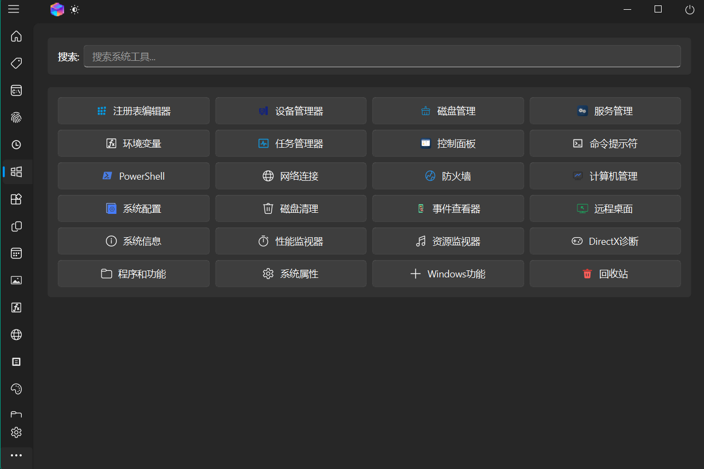
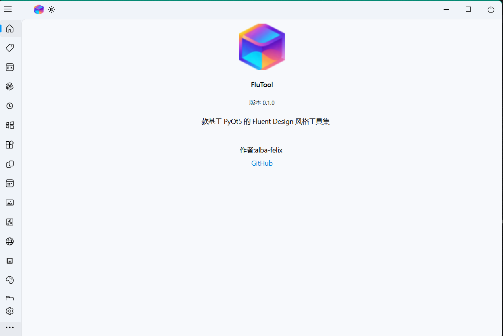

# FluTool

基于 PyQt5 和 QFluentWidgets 的多功能工具箱应用。

## 功能特性

- **插件化架构** - 模块化设计，易于扩展
- **现代 Fluent Design** - 采用 QFluentWidgets 组件库
- **多工具集成** - 一站式工具集合

## 内置插件

| 插件 | 功能 |
|------|------|
| App Launcher | 应用启动器 |
| Bookmark | 书签管理 |
| Clipboard | 剪贴板管理 |
| Color Palette | 取色器 |
| Command | 命令工具 |
| Environment | 环境变量 |
| Folder Tree | 文件夹树 |
| Image Assistant | 图片助手 |
| Network | 网络工具 |
| Notebook | 笔记本 |
| Password | 密码管理 |
| System Tools | 系统工具 |
| Text Compare | 文本对比 |
| Time Converter | 时间转换 |
| Todo | 待办事项 |

## 截图




## 环境要求

- Python 3.8+
- Windows

## 安装

```bash
pip install -r requirements.txt
```

## 运行

```bash
python main.py
```

## 打包

```bash
build.bat
```

## 技术栈

- [PyQt5](https://www.riverbankcomputing.com/software/pyqt/)
- [QFluentWidgets](https://pyqt-fluent-widgets.readthedocs.io/)

## 许可证

MIT License
